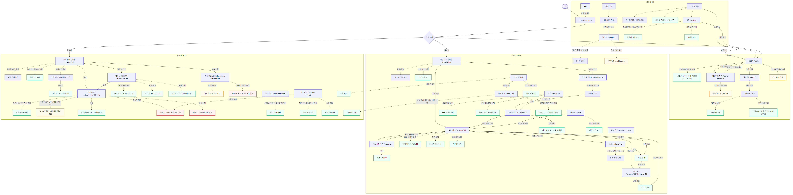
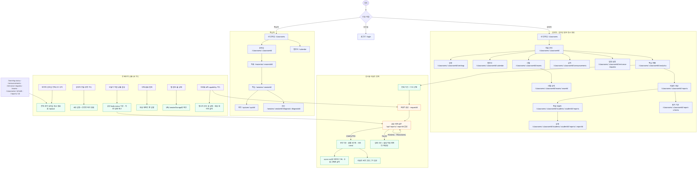

# EduPilot 전체 페이지 기능 흐름

## 기준

- FE `fix/deploy-api-base-env`의 2026-08-03 구현을 기준으로 한다.
- 첫 번째 다이어그램은 기존 기능 흐름, 두 번째는 이번에 반영한 정규 경로와 리포트 흐름이다.
- 보라색은 전 페이지 공통 UX 가드, 주황색은 백엔드 배포가 필요한 API다.
- 리포트 API는 BE #117 정책과 2026-08-05 배포 Swagger 계약을 반영했으며, 배포 빌드에서 `reports` capability를 활성화한다.

## 다운로드

- 전체 묶음: [edupilot-page-flow-diagrams.zip](./diagrams/edupilot-page-flow-diagrams.zip)
- 기존 기능 흐름: [PNG](./diagrams/01-current-page-flow.png) · [SVG](./diagrams/01-current-page-flow.svg) · [Mermaid 원본](./diagrams/01-current-page-flow.mmd)
- 개선·정규화 흐름: [PNG](./diagrams/02-improved-page-flow.png) · [SVG](./diagrams/02-improved-page-flow.svg) · [Mermaid 원본](./diagrams/02-improved-page-flow.mmd)

## 반영 내용

- 강의자 관리 메뉴를 `/classrooms/:classroomId/*` 아래로 통일했다.
- 과거 전역 링크는 최근 강의실 또는 API의 첫 강의실을 찾아 정규 경로로 `replace`한다.
- 강의자 전용 화면은 학습자 접근 시 대시보드로 조용히 보내지 않고 403 상태를 표시한다.
- 비동기 채점과 리포트 생성은 공통 폴링 훅을 사용하고 HTTP 코드가 아닌 응답 본문의 `status`로 분기한다.
- 리포트는 강사 전용이며 분석 범위는 전체 기간 또는 단일 주차 선택뿐이다.
- `INSUFFICIENT_DATA` 또는 `score=null`은 데이터 부족으로 표시하며 0점 막대를 만들지 않는다.
- 종합 단계와 추세는 서버 값을 그대로 표시한다.
- 미배포 API는 mock으로 대체하지 않고 capability가 꺼진 명시적 준비 중 상태를 사용한다.

## 이미지

